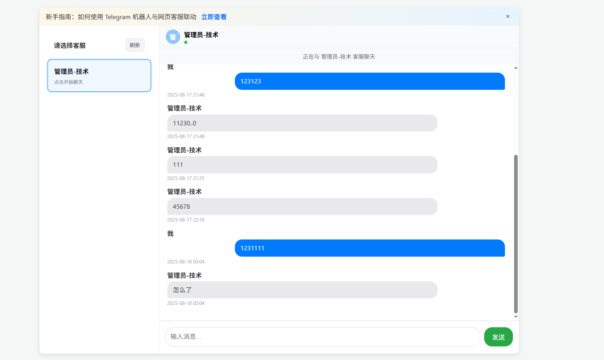
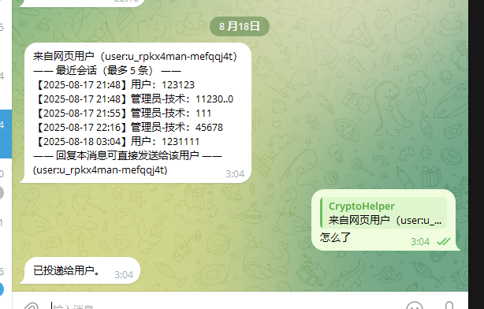

# EchoDesk — 网页客服 × Telegram 机器人

EchoDesk 是一个将网页聊天与 Telegram Bot 连接的实时客服系统。网站访客在网页端发消息，机器人把消息转发到指定客服（群组或个人）；客服在 Telegram 中“直接回复”即可回传到网页即时显示。

## 功能特性
- **实时双向通信**：Socket.IO 驱动，网页 ↔ Telegram 同步
- **多客服选择**：访客可选择在线客服接入会话
- **消息提示音**：网页端收到客服消息会播放短提示音
- **会话分组视图**：前端按客服分组展示历史消息
- **管理员权限**：除 `/help`、`/whoami` 外的命令仅管理员可用
- **快速部署**：配置 Telegram Bot Token 即可运行

## 技术栈
- Node.js, Express
- Socket.IO
- node-telegram-bot-api
- 前端：原生 HTML/CSS/JS

## 快速开始
1. 安装依赖：
```bash
npm install
```

2. 按 `.env.example` 新建 `.env`，设置你的 Bot Token：
```env
TELEGRAM_BOT_TOKEN=你的_Telegram_Bot_Token
```

3. 启动服务：
```bash
npm start
```
默认地址：http://localhost:3000

## Telegram 使用
- 将机器人加入目标群组，或与机器人进行私聊。
- 让消息正确回传到网页的方式：
  - 在 Telegram 中“直接回复”机器人转发的那条用户消息，或
  - 使用手动前缀：`session_<id>: 你的内容`

### 管理员策略
管理员 Telegram 用户 ID 在 `server.js` 中配置：`ADMIN_ID = 5294431884`。
- 所有人可用：`/help`、`/whoami`
- 仅管理员可用：
  - `/addsupport <名称>` 或 `/addsupport <名称> <tg_id|@username>`
  - `/listsupport`
  - `/removesupport [me|<tg_id|@username>]`
> 注：使用 `@username` 注册/移除时，该用户需要先至少与机器人聊过一次。

## 系统展示

- 首页与客服选择



_访客进入后选择在线客服开始会话。_

- 实时聊天与 Telegram 联动



_网页与 Telegram 机器人双向同步，客服在 Telegram 直接回复即可回传到网页。_

## 网页端
- 选择一个在线客服后开始对话
- 收到客服消息会自动显示并播放提示音
- 前端页面与使用指南位于 `public/`（`index.html`、`client.js`、`style.css`、`guide.html`）

## 联系开发者
- Telegram：[@abcz110](https://t.me/abcz110)

## 项目结构
- `server.js` — 服务端与 Telegram 机器人逻辑
- `public/` — 前端静态资源
  - `index.html`, `client.js`, `style.css`, `guide.html`
- `.env.example` — 环境变量示例
- `package.json` — 脚本与依赖

## 安全与提交
- `.gitignore` 已忽略 `node_modules/` 与 `.env`（不要提交密钥）
- 仅提交 `.env.example`

## 许可证
MIT License（见 `LICENSE`）。
